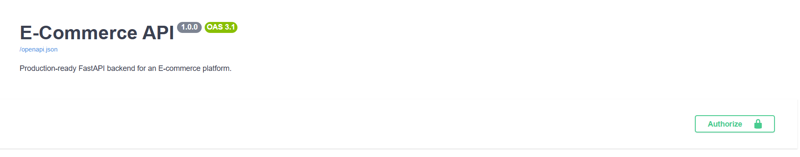
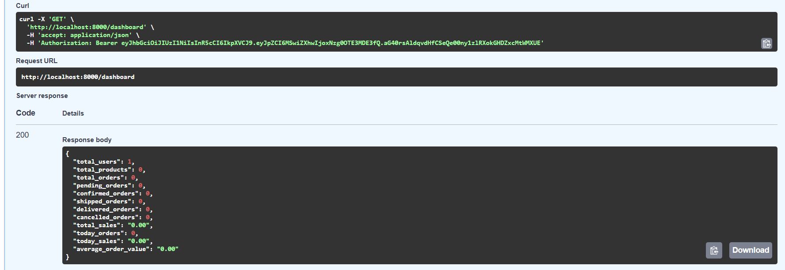

# 🛒 E-Commerce API

A **production-ready E-Commerce REST API** built with **FastAPI**, featuring authentication, product management, shopping cart, order processing, payment integration, AI-powered product search, Redis caching, Docker support, and more.

---

# 📸 Screenshots

## Swagger UI



## Dashboard



---

# 📖 Overview

This project is a scalable backend application for an e-commerce platform built using **FastAPI** following a modular architecture.

It includes:

* JWT Authentication
* Role Based Access Control (RBAC)
* Product & Category Management
* Shopping Cart
* Order Management
* Razorpay Payment Integration
* AI Product Search
* Product Reviews & Ratings
* Email Notifications
* Redis Caching
* Dockerized Deployment
* Alembic Database Migrations

The project follows clean architecture principles with separate modules for each domain.

---

# ✨ Features

## 🔐 Authentication

* User Registration
* User Login
* JWT Authentication
* Password Hashing (bcrypt)
* Role Based Authorization
* Bootstrap Admin Creation
* Change Password
* Update Profile

---

## 📦 Product Management

* Product CRUD
* Category CRUD
* Product Search
* Product Pagination
* Product Statistics
* Low Stock Detection
* Automatic Rating Calculation
* AI Generated Metadata
* Product Filtering

---

## 🛒 Shopping Cart

* Add Product to Cart
* Update Quantity
* Remove Item
* Clear Cart
* Quantity Validation

---

## 📋 Orders

* Checkout
* Order History
* Order Details
* Order Cancellation
* Admin Order Management
* Order Status Workflow

Status Flow

```
PENDING
    ↓
CONFIRMED
    ↓
SHIPPED
    ↓
DELIVERED
```

Orders may also become

```
CANCELLED
```

---

## 💳 Payments

Integrated with **Razorpay**

Features

* Create Payment Order
* Verify Payment Signature
* Secure Payment Verification
* Refund Support
* Automatic Stock Reduction
* Atomic Inventory Update
* Payment Status Tracking

---

## ⭐ Reviews

* Create Review
* Update Review
* Delete Review
* Product Rating
* Review Statistics
* Admin Review Moderation

---

## 🤖 AI Features

Powered by **Groq AI**

* AI Product Search
* AI Product Metadata Generation

---

## 📧 Email Notifications

Using **Brevo API**

* Welcome Email
* Order Status Email

---

## 🚀 Performance

* Redis Caching
* Cache Invalidation
* Pagination
* Optimized SQL Queries
* Joined Loading
* Atomic Stock Updates

---

## 📊 Admin Dashboard

* User Statistics
* Product Statistics
* Order Statistics
* Revenue Overview
* Low Stock Products

---

# 🏗️ Tech Stack

## Backend

* FastAPI
* Python 3.12

## Database

* PostgreSQL
* SQLAlchemy ORM
* Alembic

## Authentication

* JWT
* Passlib (bcrypt)

## Payments

* Razorpay

## Caching

* Redis

## AI

* Groq API

## Email

* Brevo API

## Deployment

* Docker
* Docker Compose
* Uvicorn

---

# 📁 Project Structure

```
ecommerce-api/
│
├── alembic/
│
├── src/
│   ├── ai/
│   ├── auth/
│   ├── cache/
│   ├── cart/
│   ├── category/
│   ├── dashboard/
│   ├── email/
│   ├── exceptions/
│   ├── notification/
│   ├── order/
│   ├── payment/
│   ├── product/
│   ├── review/
│   ├── user/
│   └── utils/
│
├── images/
│   ├── swagger-ui.png
│   └── dashboard.png 
│
├── .dockerignore
├── .gitignore
├── .gitattributes
├── docker-compose.yml
├── Dockerfile
├── entrypoint.sh
├── alembic.ini
├── main.py
├── README.md
└── requirements.txt
```

---

# 🗄️ Database

* PostgreSQL
* SQLAlchemy ORM
* Alembic Migrations

Main entities

* Users
* Categories
* Products
* Cart
* Cart Items
* Orders
* Order Items
* Reviews

---

# 🔄 Order Lifecycle

```
User
    │
    ▼
Cart
    │
    ▼
Checkout
    │
    ▼
Create Razorpay Order
    │
    ▼
Verify Payment
    │
    ▼
Reduce Inventory
    │
    ▼
Confirm Order
```

---

# 🐳 Docker

Build and start

```bash
docker compose up --build
```

Run in background

```bash
docker compose up -d
```

Stop

```bash
docker compose down
```

Stop and remove database volume

```bash
docker compose down -v
```

---

# ⚙️ Environment Variables

Create a `.env` file

```env
DB_CONNECTION=

REDIS_URL=

SECRET_KEY=
ALGORITHM=
EXPIRY_TIME=

ADMIN_NAME=
ADMIN_USERNAME=
ADMIN_EMAIL=
ADMIN_PASSWORD=

BREVO_API_KEY=
EMAIL_FROM=
EMAIL_FROM_NAME=

GROQ_API_KEY=
GROQ_MODEL=

RAZORPAY_KEY_ID=
RAZORPAY_KEY_SECRET=
RAZORPAY_WEBHOOK_SECRET=
```

---

# 🚀 Running Locally

Create virtual environment

```bash
python -m venv venv
```

Activate

Windows

```bash
venv\Scripts\activate
```

Install dependencies

```bash
pip install -r requirements.txt
```

Run migrations

```bash
alembic upgrade head
```

Start server

```bash
uvicorn main:app --reload
```

Swagger

```
http://localhost:8000/docs
```

---

# 📌 API Modules

* Authentication
* Users
* Categories
* Products
* Cart
* Orders
* Payments
* Reviews
* Dashboard
* AI

---

# 📈 Performance Optimizations

* Redis Cache
* Cache Invalidation
* SQLAlchemy Joined Loading
* Atomic Inventory Updates
* Password Hashing
* JWT Authentication

---

# 🔒 Security

* JWT Authentication
* Password Hashing
* RBAC
* Payment Signature Verification
* Input Validation
* SQLAlchemy ORM Protection
* Environment Variables
* Atomic Database Updates

---

# 🧪 Testing

Future improvements include

* Unit Tests
* Integration Tests
* API Tests
* Payment Tests

---

# 🚧 Future Improvements

* Wishlist
* Coupons & Discounts
* Razorpay Webhooks
* Background Tasks with Celery
* Elasticsearch
* Kubernetes
* CI/CD Pipeline

---

# 👨‍💻 Author

**Fardeen Chavan**

GitHub:
https://github.com/fardeenchawhan

---

# ⭐ If you like this project

Consider giving it a ⭐ on GitHub!

